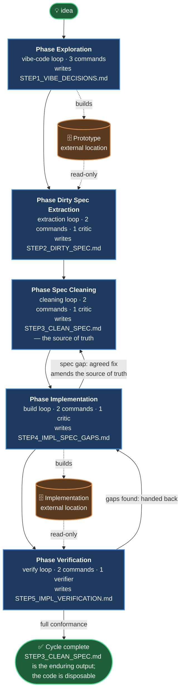
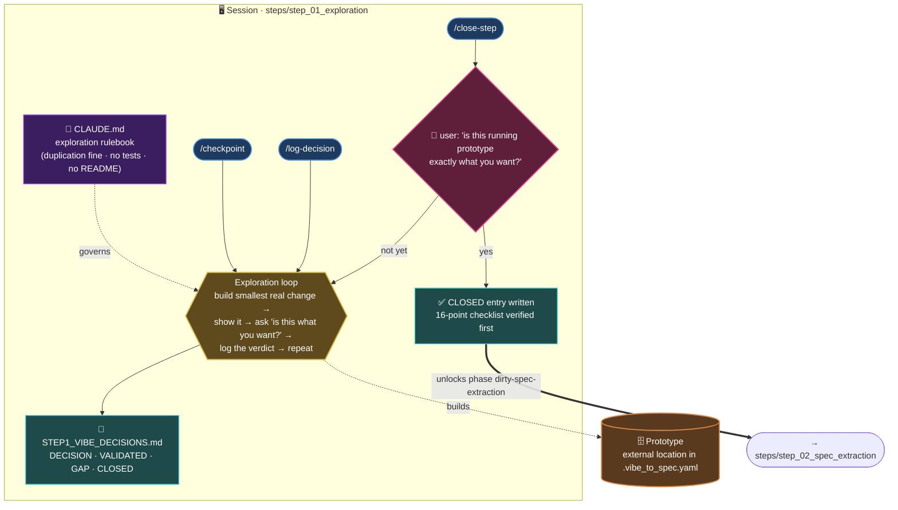
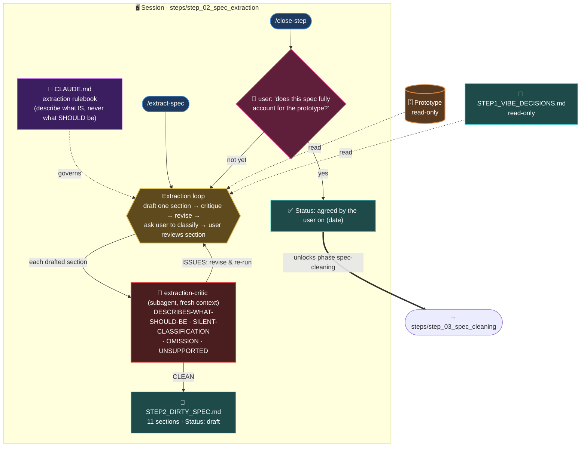
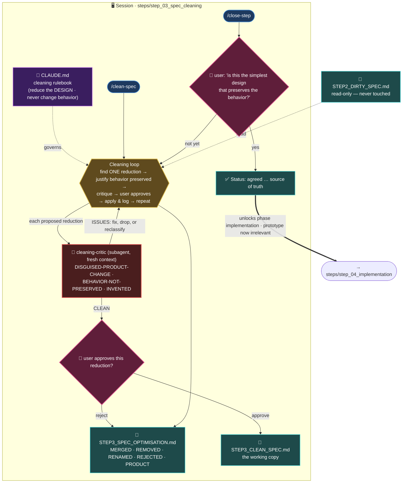
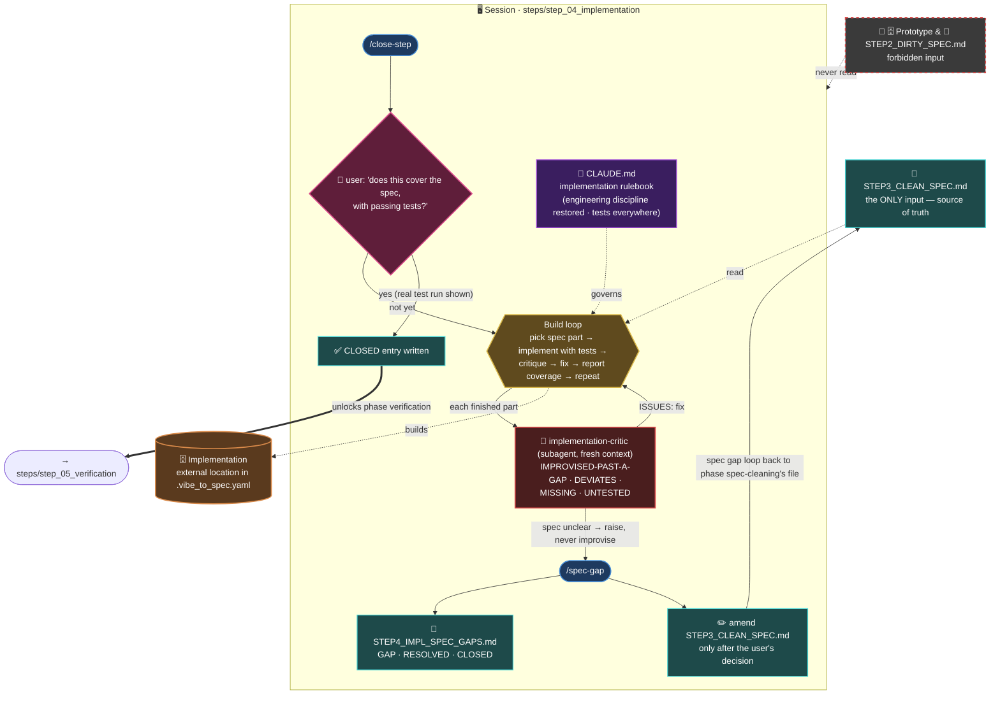
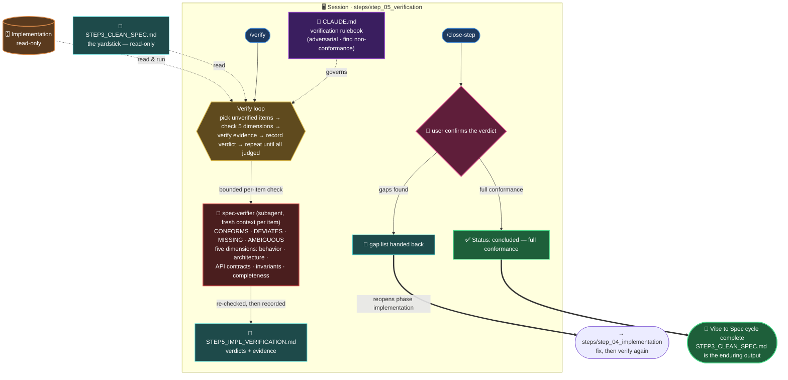

# The Global Workflow of Vibe to Spec

A single map of the whole [Vibe to Spec](../README.md) methodology: the five phases, the external code they build and check, the records they write, the loops that keep the specification honest, and the human approval gates that only the user can pass.

## A note on reading this map (why it is layered, not one giant picture)

A single flowchart that shows every command, every subagent, every record, and every loop at once is unreadable, and no diagram tool that renders inside a markdown file on the web can help: a diagram renders at one fixed level of detail, and zooming out only makes the same crowded picture smaller — it never shows *less*. So this map is layered instead, the way a road atlas has a country map and then city maps:

- **[The overview graph](#the-overview-graph-the-zoomed-out-view)** is the zoomed-out view: only the five phases, the two external code stores, and the loops between them. This is the whole methodology on one screen.
- **[The five per-phase graphs](#phase-exploration-detail)** are the zoomed-in views: each one opens a single phase and shows its rulebook, its slash commands, its adversarial subagent, its internal loop, the records it writes, and its close-step gate.

Read the overview first, then open only the phase you care about. That is the "zoom in without seeing everything" behavior, done by hierarchy rather than by a zoom control.

## Metrics at a glance

At its heart vibe-to-spec methodology is **loops of agents**: an agent runs a working loop inside each phase, a second agent runs an adversarial loop that tries to tear down the first agent's output, and two more loops feed corrections back across the phases. **11 loops in all** keep the specification honest.

| | | |
|---:|:--|:--|
| **11** | **loops of agents** | 5 working loops (one per phase) + 4 adversarial critique loops + 2 cross-phase feedback loops |
| **5** | **isolated agent sessions** | one Claude Code session per phase — nothing leaks between them |
| **4** | **adversarial reviewer agents** | a fresh critic tears down each phase's output before the user ever sees it |
| **5** | **human approval gates** | only the user's explicit "yes" ever closes a phase |
| **6** | **durable records** | the `STEP*.md` files — the permanent output; the code stays disposable |
| **2** | **throwaway codebases** | the prototype and the production build, both rebuildable from the specification |

The two feedback loops are the important ones: **Implementation → Spec Cleaning** writes every gap found while building back into the source-of-truth specification, and **Verification → Implementation** hands its deviations back to be fixed and re-verified — the code is never allowed to drift from the specification in either direction.

## The overview graph (the zoomed-out view)

The whole methodology on one screen: five phases on a spine, the two external code stores off to the side, and the loops that feed the source of truth. Everything a phase does internally is hidden here — open its own graph below for that.

**The two loops that keep the source of truth honest:**

1. **Phase Implementation → Phase Spec Cleaning** — every specification gap found while implementing is logged in `STEP4_IMPL_SPEC_GAPS.md`; once the user resolves it, the agreed fix is written back into `STEP3_CLEAN_SPEC.md` itself. The specification never drifts silently from the implementation.
2. **Phase Verification → Phase Implementation** — verification hands its list of deviations back to phase implementation, which fixes the code; verification then runs again. The cycle repeats until every specification item conforms.

## Phase Exploration (detail)

- **Session:** `cd steps/step_01_exploration && claude`
- **Question:** what do I actually want?
- **Output:** a running prototype the user has explicitly validated, plus its decision log.

## Phase Dirty Spec Extraction (detail)

- **Session:** `cd steps/step_02_spec_extraction && claude`
- **Question:** what did I actually build?
- **Precondition:** phase exploration's `CLOSED` entry exists.
- **Output:** `STEP2_DIRTY_SPEC.md`, the raw specification.

## Phase Spec Cleaning (detail)

- **Session:** `cd steps/step_03_spec_cleaning && claude`
- **Question:** what is the simplest design?
- **Precondition:** the raw spec's status reads "agreed by the user".
- **Output:** `STEP3_CLEAN_SPEC.md` — the source of truth for everything after.

## Phase Implementation (detail)

- **Session:** `cd steps/step_04_implementation && claude`
- **Question:** how should it be built?
- **Precondition:** the spec's status reads "agreed … source of truth".
- **Output:** production code with tests, plus the gap log.
- **Forbidden input:** the prototype and the raw spec — never read.

## Phase Verification (detail)

- **Session:** `cd steps/step_05_verification && claude`
- **Question:** does it match the specification?
- **Precondition:** the spec is the source of truth and phase implementation's `CLOSED` entry exists.
- **Output:** `STEP5_IMPL_VERIFICATION.md` — evidence-backed verdicts.

## Legend

| Symbol | Meaning |
|---|---|
| 📕 rulebook | A phase's `CLAUDE.md` — the discipline that governs that one session |
| `/command` | A slash command available inside that phase's session |
| 🤖 subagent | An adversarial reviewer run in a fresh context: the three critics and the verifier |
| 📄 record | A durable `STEP*.md` file — the phase's permanent output |
| 🗄️ external store | The prototype or the production implementation, both living outside this repository |
| 👤 gate | A human approval gate — only the user's explicit answer passes it |
| dashed edge | Read-only access, or "builds" — never a modification of the source |
| solid double edge (`==>`) | A phase unlocks or hands off to the next |
