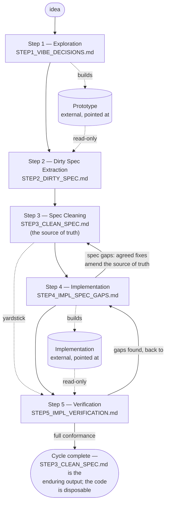

# The Five Steps

This folder implements the [Vibe to Spec](https://github.com/jeromeetienne/vibe_to_spec/issues/1) methodology as five working folders, one per step. Each step folder carries its own Claude Code configuration (`CLAUDE.md`, `.claude/commands/`, `.claude/agents/`), so a Claude Code session started inside one step folder only sees the tooling meant for that step.

Jump straight to a step's own walkthrough:

- [Step 1 — Exploration](./step_01_exploration/README.md)
- [Step 2 — Dirty Spec Extraction](./step_02_spec_extraction/README.md)
- [Step 3 — Spec Cleaning](./step_03_spec_cleaning/README.md)
- [Step 4 — Implementation](./step_04_implementation/README.md)
- [Step 5 — Verification](./step_05_verification/README.md)

The artifact flow through the five steps:

Two loops keep the source of truth honest: step 4 logs every specification gap in `STEP4_IMPL_SPEC_GAPS.md` and, once the user resolves it, applies the agreed fix to `STEP3_CLEAN_SPEC.md` — the specification never drifts from the implementation silently; and step 5 hands its gap list back to step 4 until verification shows full conformance. When the cycle completes, the real output is `STEP3_CLEAN_SPEC.md` — the code can always be rebuilt from it.

## The methodology template

Every step is described by the same nine fields:

| Field | Meaning |
|---|---|
| **Folder** | `steps/step_NN_<name>` — the step's workspace and the working directory for its Claude Code sessions |
| **Goal** | The one thing the step achieves (one line) |
| **Question** | The single question the step answers |
| **Inputs** | The artifacts the step consumes, with concrete relative paths to the earlier step that produced them |
| **Outputs** | The artifacts the step produces, living in its own folder, and which later step consumes them |
| **Way of working** | The behavioral rules: what is encouraged, tolerated, and forbidden during the step |
| **Claude Code configuration** | What lives in the step's `CLAUDE.md`, `.claude/commands/`, `.claude/agents/` — each entry justified by the step's job |
| **Done when** | The observable exit condition that allows hand-off to the next step |
| **Workflow detail** | A link to the step's own `README.md` — the narrative walkthrough of how it starts, iterates, and ends |

This template, each step's own `README.md`, and each step's `CLAUDE.md` describe the same facts at three levels of detail — reference table, narrative walkthrough, and the operational rules the agent actually follows. None is generated from the others, so a rule change needs to be applied in all three places to stay in sync.

Pervasive rules that apply to every step:

- The methodology's records (`STEP1_VIBE_DECISIONS.md`, `STEP2_DIRTY_SPEC.md`, `STEP3_CLEAN_SPEC.md`, `STEP3_SPEC_OPTIMISATION.md`, `STEP4_IMPL_SPEC_GAPS.md`, `STEP5_IMPL_VERIFICATION.md`) all live flat in one folder, external to this checkout, recorded as `artifacts` in the active project's `.vibe_to_spec.yaml`. Every step reads and writes them at that shared location, addressed as `<artifacts>/STEPN_....md`. Nothing is copied forward.
- A record signals that its step is done in one of two ways, depending on its own shape: an append-only log (`STEP1_VIBE_DECISIONS.md`, `STEP4_IMPL_SPEC_GAPS.md`) closes with a `CLOSED` bullet appended to its dated entries; a document edited in place (`STEP2_DIRTY_SPEC.md`, `STEP3_CLEAN_SPEC.md`, `STEP5_IMPL_VERIFICATION.md`) closes by updating its `Status:` line instead.
- The project's code is **never** in this repository: the step 1 prototype and the step 4 production implementation each live in their own repository or folder, pointed at via a GitHub link (an https or git URL) or an absolute path on the local disk. The pointer is recorded in the active project's `.vibe_to_spec.yaml` — as `dirty_impl_resources` (the prototype) and `clean_impl_resources` (the production implementation) — so the later steps know where to look.
- The repository root has a minimal `CLAUDE.md` whose only job is resolving the active project's `.vibe_to_spec.yaml` config; it carries no step-specific rules, so nothing about a step's own discipline leaks between steps. The developer's global `~/.claude/CLAUDE.md` still applies everywhere; a step's own `CLAUDE.md` overrides it where the step requires (for example, step 1 suspends cleanup discipline).
- Every step iterates internally before it closes. Each step's `CLAUDE.md` defines a loop specific to that step's action — build and show an increment (step 1), extract one spec section (step 2), propose one reduction (step 3), implement one spec section (step 4), verify one batch of spec items (step 5). The loop repeats until the step's exit condition is met. `/close-step` is the gate: it either confirms the exit or sends the developer back into the loop.
- Every step except step 1 critiques each unit of work before the user sees it. The step's `CLAUDE.md` names a fresh-context critic subagent — `extraction-critic` (step 2), `cleaning-critic` (step 3), `implementation-critic` (step 4), `spec-verifier` (step 5) — that reviews the drafted unit blind to the assumptions that produced it, against a fixed checklist of that step's one characteristic failure. The main session revises until the critic is satisfied, then shows the user. The critic raises the draft's quality; it never replaces the user's review, and it never decides anything only the user may decide. Step 1 is exempt — its rough increments are the signal, and polishing them before the user reacts would defeat the exploration.
- Configurations stay lean: a slash command for a repeatable step action; a custom agent only where there is genuinely bounded, delegable work. Continuous creative work stays in the main session.

## The five steps

### `steps/step_01_exploration`

- **Goal**: explore the product.
- **Question**: What do I actually want?
- **Inputs**: the initial idea; nothing formal.
- **Outputs**: a running prototype explicitly validated by the user, living in its own external repository or folder (recorded as `dirty_impl_resources` in the project's `.vibe_to_spec.yaml`) + `STEP1_VIBE_DECISIONS.md`, the log of decisions, user validations, gaps, and the final agreement → consumed by step 02.
- **Way of working**: fast and messy; duplication and technical debt are fine; changing direction is encouraged; no tests, no cleanup, no documentation. Continuous explicit user validation: after every increment, ask "is this what you want?" — silence is never agreement.
- **Claude Code configuration**: `CLAUDE.md` that suspends engineering-discipline instincts and defines the validation loop and the `STEP1_VIBE_DECISIONS.md` format; three commands — `/checkpoint` (one validation round: show, ask, log), `/log-decision` (log one DECISION / VALIDATED / GAP entry as it happens), `/close-step` (the closing walkthrough and the final agreement). No custom agents.
- **Done when**: the user has explicitly agreed the running prototype is exactly what they want — recorded as the `CLOSED` entry in `STEP1_VIBE_DECISIONS.md`, with any accepted gaps listed.
- **Workflow detail**: [step_01_exploration/README.md](step_01_exploration/README.md).

### `steps/step_02_spec_extraction`

- **Goal**: recover the architecture that was actually built.
- **Question**: What did I actually build?
- **Inputs**: the prototype, at the external location(s) recorded as `dirty_impl_resources` in the project's `.vibe_to_spec.yaml`, plus `<artifacts>/STEP1_VIBE_DECISIONS.md` — all treated strictly read-only.
- **Outputs**: `STEP2_DIRTY_SPEC.md` — the raw specification: concepts, responsibilities, workflows, APIs, data structures, invariants, constraints, assumptions → consumed by step 03.
- **Way of working**: analytical, descriptive; write down what **is**, not what should be; ignore implementation details unless architecturally significant; no fixing, no improving of the prototype.
- **Claude Code configuration**: `CLAUDE.md` with the extraction rules and input paths; two commands — `/extract-spec` (drives a full extraction pass) and `/close-step` (the closing walkthrough and the final agreement); one subagent — `extraction-critic`, a fresh-context reviewer that critiques each drafted section before the user sees it.
- **Done when**: `STEP2_DIRTY_SPEC.md` fully accounts for the prototype's observed behavior.
- **Workflow detail**: [step_02_spec_extraction/README.md](step_02_spec_extraction/README.md).

### `steps/step_03_spec_cleaning`

- **Goal**: reduce the design's complexity without changing behavior.
- **Question**: What is the simplest design that preserves the same behavior?
- **Inputs**: `<artifacts>/STEP2_DIRTY_SPEC.md`.
- **Outputs**: `STEP3_CLEAN_SPEC.md` (cleaned) — **the source of truth** for everything after → consumed by steps 04 and 05.
- **Way of working**: reductive only — merge duplicated concepts, remove needless options, unify terminology, clarify responsibilities; nothing new is invented; every removal must preserve behavior.
- **Claude Code configuration**: `CLAUDE.md` with the cleaning rules; two commands — `/clean-spec` (propose and apply one reduction at a time) and `/close-step` (the closing walkthrough and the final agreement); one subagent — `cleaning-critic`, a fresh-context reviewer that checks each proposed reduction preserves behavior before the user sees it.
- **Done when**: nothing further can be removed without changing behavior.
- **Workflow detail**: [step_03_spec_cleaning/README.md](step_03_spec_cleaning/README.md).

### `steps/step_04_implementation`

- **Goal**: build production software from the specification.
- **Question**: How should this specification be implemented?
- **Inputs**: `<artifacts>/STEP3_CLEAN_SPEC.md` **only** — explicitly not the prototype.
- **Outputs**: the production implementation with its tests, living in its own external repository or folder (recorded as `clean_impl_resources` in the project's `.vibe_to_spec.yaml`) → consumed by step 05.
- **Way of working**: full engineering discipline restored (the developer's global style rules apply in full); the specification is authoritative; when it is ambiguous or looks wrong, record the gap in `STEP4_IMPL_SPEC_GAPS.md` and ask — never silently improvise around it. Agreed resolutions are applied to `<artifacts>/STEP3_CLEAN_SPEC.md` itself, so the source of truth stays true.
- **Claude Code configuration**: `CLAUDE.md` stating "the specification is law" plus restored discipline; two commands — `/spec-gap` (logs specification ambiguities back for resolution — the mirror image of step 1's `/log-decision`) and `/close-step` (the closing walkthrough and the final agreement); one subagent — `implementation-critic`, a fresh-context reviewer that checks each implemented part against the specification before it is marked done.
- **Done when**: the implementation is complete per the specification and its tests pass.
- **Workflow detail**: [step_04_implementation/README.md](step_04_implementation/README.md).

### `steps/step_05_verification`

- **Goal**: verify the implementation matches the specification.
- **Question**: Does this implementation faithfully realize the specification?
- **Inputs**: `<artifacts>/STEP3_CLEAN_SPEC.md` + the implementation at the external location(s) recorded as `clean_impl_resources` in the project's `.vibe_to_spec.yaml` — never the prototype.
- **Outputs**: `STEP5_IMPL_VERIFICATION.md` — a per-item verdict covering behavior, architecture, API contracts, invariants, completeness; gaps are filed back to step 04.
- **Way of working**: adversarial review; the specification is the yardstick; findings are verified before being reported.
- **Claude Code configuration**: `CLAUDE.md` with the verification rules; two commands — `/verify` (one verification pass) and `/close-step` (the concluding ritual); this step is also the natural home for custom reviewer subagents (bounded, delegable checks).
- **Done when**: `STEP5_IMPL_VERIFICATION.md` shows full conformance — or its gap list goes back to step 04 and the loop repeats.
- **Workflow detail**: [step_05_verification/README.md](step_05_verification/README.md).
