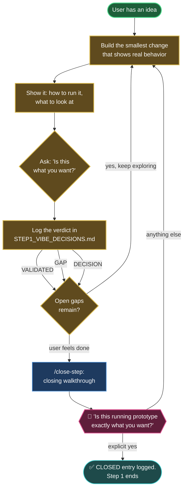

# Step 1 — Exploration

Explore the product by vibe coding. This step ends with a running prototype that the user has explicitly agreed is exactly what they want — not with clean code, and not with a specification.

## How it starts

- **Precondition**: nothing formal — an idea in the user's head is enough.
- **Where**: start the AI coding agent inside this folder:

  ```bash
  cd steps/step_01_exploration && claude
  ```

  The session picks up this folder's `CLAUDE.md` (the exploration rules) and its commands (`/checkpoint`, `/log-decision`, `/close-step`).
- **First move**: the user says where the prototype lives — its own repository or folder, completely outside this repository, given as a GitHub link or an absolute path on the local disk — and the agent records it as a `dirty_impl_resources` entry in the project's `.vibe_to_spec.yaml`. Then the user says what they want to try, and the agent builds the smallest thing that shows real behavior, at that location.

## What you say to steer it

This step is a conversation you steer, not a form you fill in. You do not need a plan or the right words — you say what you want to try, then react to what the agent builds and runs in front of you. Below are the kinds of things you would say at each moment of the loop; use your own words, these are only to show the shape.

- **To begin** — say where the prototype should live and what to try first:
  > "Put the prototype at ~/code/my-app. Build the smallest thing that lets me type a note and see it saved."

- **To react to what was built** — you judge the running behavior, never the code:
  > "Yes, that's exactly the list I wanted — keep it."
  > "Run it for me again — where do I click to see the saved note?"

- **To flag what's wrong** — say it in your own words, it gets logged as a gap:
  > "No, the colors are too cold. I want a warmer palette."
  > "Deleting shouldn't happen without asking me first."

- **To change direction** — pivoting is expected, nothing is wasted:
  > "Forget the database, just use a plain file. The setup is slowing us down."

- **To close the step** — only when the running prototype is exactly what you want:
  > "This is exactly what I wanted. Run /close-step."

## How it iterates — the exploration loop



See the [global workflow map's legend](../../docs/global_workflow.md#legend) for what each color and symbol means.

Every increment goes through the same loop:

1. **Build** the smallest change that shows real behavior.
2. **Show** it: the agent says exactly how to run it and what to look at. The user validates behavior — what the prototype does when run — never the code.
3. **Ask**: the agent explicitly asks "Is this what you want?" plus pointed follow-ups — what feels wrong or off? what is missing? continue this direction, or change? Silence is never agreement.
4. **Log** the user's verdicts in `STEP1_VIBE_DECISIONS.md`:
   - `VALIDATED` — behavior the user explicitly confirmed as wanted
   - `GAP` — what the user explicitly said is NOT what they want, kept in the user's own words; stays open until fixed or explicitly accepted
   - `DECISION` — a direction chosen, changed, or abandoned, and why
5. **Repeat** — pivoting freely. Messy code, duplication, and dead ends are all fine; cleanup, tests, and documentation of the prototype are not this step's job.

Commands used during the loop:

- `/checkpoint` — run one validation round on demand (the agent also triggers it itself after every meaningful behavior change).
- `/log-decision` — log a single `DECISION` / `VALIDATED` / `GAP` entry the moment it happens in conversation.

## How it ends

- **Trigger**: the user feels the prototype is what they want and runs `/close-step` — or the agent proposes closing when no open gaps remain.
- **The closing walkthrough**: an end-to-end demonstration of the running prototype; every still-open `GAP` is either fixed now or explicitly accepted by the user; then the final question, verbatim: **"Is this running prototype exactly what you want?"**
- **The step closes ONLY on the user's explicit yes**, recorded as the `CLOSED` entry in `STEP1_VIBE_DECISIONS.md`, with the accepted gaps listed (or "none"). The agent never closes the step on its own.
- **Hand-off**: the validated prototype stays in its external repository or folder, recorded as `dirty_impl_resources` in the project's `.vibe_to_spec.yaml`; `STEP1_VIBE_DECISIONS.md` lives at `<artifacts>/STEP1_VIBE_DECISIONS.md`. Step 2 reads both, read-only.
