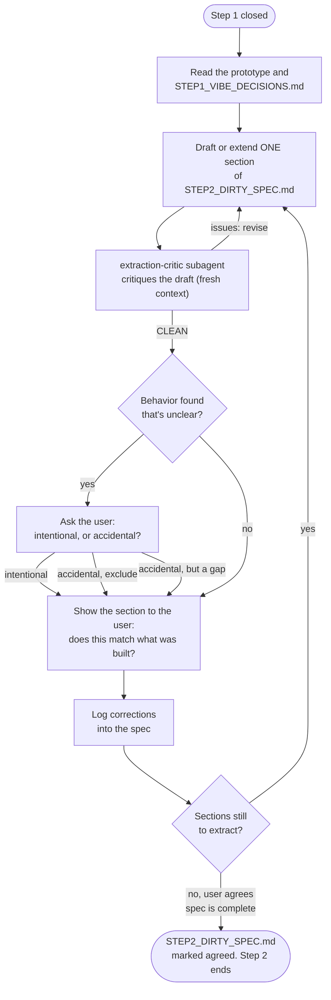

# Step 2 — Dirty Specification Extraction

Recover the architecture that was actually built. This step turns the validated prototype of step 1 into `STEP2_DIRTY_SPEC.md` — the raw specification of what the prototype is and does.

## How it starts

- **Precondition**: step 1 is closed — the prototype recorded as `dirty_impl_resources` in the project's `.vibe_to_spec.yaml` runs, and `<artifacts>/STEP1_VIBE_DECISIONS.md` ends with the `CLOSED` entry (the user's explicit agreement).
- **Where**: start the AI coding agent inside this folder:

  ```bash
  cd steps/step_02_spec_extraction && claude
  ```

- **Inputs, strictly read-only**:
  - the prototype — at the external location(s) recorded as `dirty_impl_resources` in the project's `.vibe_to_spec.yaml` (its code is completely outside this repository)
  - `<artifacts>/STEP1_VIBE_DECISIONS.md` — the validations, gaps, and pivots, with the reasoning behind them

## How it iterates



1. **Read** the prototype and `STEP1_VIBE_DECISIONS.md`; observe what the prototype actually does.
2. **Write** `STEP2_DIRTY_SPEC.md` in this folder, section by section: concepts, responsibilities, workflows, APIs, data structures, invariants, constraints, assumptions.
3. **Describe what IS, not what should be.** Implementation details are ignored unless architecturally significant. Gaps the user explicitly accepted at the end of step 1 are recorded in the spec as known gaps — never silently "fixed" on paper.
4. **Critique the draft** with the `extraction-critic` subagent in a fresh context, before the user sees it: it flags any place the draft says what should be instead of what is, any behavior classified without asking, and anything omitted or unsupported. Revise until it comes back clean.
5. **Review with the user**, section by section: does the spec say what the prototype does? Is anything missing or over-stated?
6. **Repeat** until the spec accounts for all observed behavior.

The prototype is never modified in this step — it is an input, not a workspace. Nothing is improved, nothing is redesigned; that comes later.

## How it ends

- `STEP2_DIRTY_SPEC.md` fully accounts for the prototype's observed behavior, and the user explicitly agrees it does.
- **Hand-off**: `STEP2_DIRTY_SPEC.md` lives at `<artifacts>/STEP2_DIRTY_SPEC.md`; step 3 reads it.
