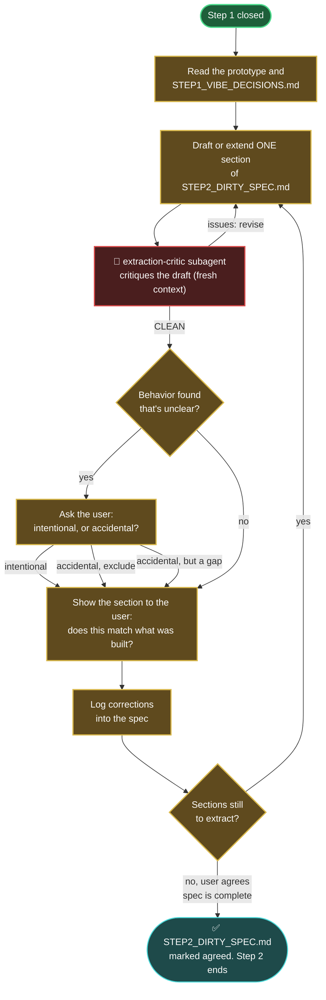

# Step 2 — Dirty Spec Extraction

Recover the architecture that was actually built. This step turns the validated prototype of step 1 into `STEP2_DIRTY_SPEC.md` — the raw specification of what the prototype is and does.

`STEP2_DIRTY_SPEC.md` must be understandable by someone who has never seen the prototype, and every concept name in it must be explicit and unambiguous.

## How it starts

- **Precondition**: step 1 is closed — the prototype recorded as `dirty_impl_resources` in the project's `.vibe_to_spec.yaml` runs, and `<artifacts>/STEP1_VIBE_DECISIONS.md` ends with the `CLOSED` entry (the user's explicit agreement).
- **Where**: start the AI coding agent inside this folder:

  ```bash
  cd steps/step_02_spec_extraction && claude
  ```

- **Inputs, strictly read-only**:
  - the prototype — at the external location(s) recorded as `dirty_impl_resources` in the project's `.vibe_to_spec.yaml` (its code is completely outside this repository)
  - `<artifacts>/STEP1_VIBE_DECISIONS.md` — the validations, gaps, and pivots, with the reasoning behind them

## What you say to steer it

This step is a conversation you steer, not a form you fill in. You do not need to know the spec structure or the exact words — you point the agent at the prototype, react to what it drafts, and decide the calls only you can decide. Below are the kinds of things you would say at each moment of the loop; use your own words, these are only to show the shape.

- **To begin** — point it at the prototype and let it read:
  > "Start extracting the spec. Read the prototype and STEP1_VIBE_DECISIONS.md first, then draft the Purpose section."

- **To steer which section comes next** — you decide the order and the depth:
  > "The workflows matter most to me — do those next, before the data structures."
  > "Go deeper on the API section; you've only listed the endpoints, not what each one expects."

- **To answer 'intentional or accidental?'** — the one call only you can make:
  > "That retry-on-failure behavior is intentional — it goes in the spec."
  > "No, the prototype only does that because I never handled the empty case. That's accidental — record it as a known gap, don't design a fix."
  > "That's just leftover debug output. Exclude it, it's not wanted."

- **To correct a draft** — say what the prototype actually does:
  > "This says the cache 'should expire after an hour' — but the prototype never expires it at all. Describe what it does, not what it should do."
  > "You've missed that uploads over 10 MB are silently dropped. Add that."
  > "'The sync thing' isn't a clear concept name — call it exactly what it is, so someone who never saw the prototype knows what you mean."

- **To close the step** — only when you agree the spec is complete:
  > "This fully matches what I built. Run /close-step."

## How it iterates



See the [global workflow map's legend](../../docs/global_workflow.md#legend) for what each color and symbol means.

1. **Read** the prototype and `STEP1_VIBE_DECISIONS.md`; observe what the prototype actually does.
2. **Write** `STEP2_DIRTY_SPEC.md` in this folder, section by section: concepts, responsibilities, workflows, APIs, data structures, invariants, constraints, assumptions.
3. **Describe what IS, not what should be.** Implementation details are ignored unless architecturally significant. Gaps the user explicitly accepted at the end of step 1 are recorded in the spec as known gaps — never silently "fixed" on paper.
4. **Critique the draft** with the `extraction-critic` subagent in a fresh context, before the user sees it: it flags any place the draft says what should be instead of what is, any behavior classified without asking, and anything omitted or unsupported. Revise until it comes back clean.
5. **Review with the user**, section by section: does the spec say what the prototype does? Is anything missing or over-stated?
6. **Repeat** until the spec accounts for all observed behavior.

The prototype is never modified in this step — it is an input, not a workspace. Nothing is improved, nothing is redesigned; that comes later.

## How it ends

- `STEP2_DIRTY_SPEC.md` fully accounts for the prototype's observed behavior, and the user explicitly agrees it does.
- **Hand-off**: `STEP2_DIRTY_SPEC.md` lives at `<artifacts>/STEP2_DIRTY_SPEC.md`; step 3 reads it.
