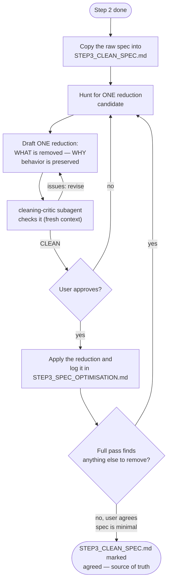

# Step 3 — Specification Cleaning

Reduce the design's complexity without changing behavior. The output is the cleaned `STEP3_CLEAN_SPEC.md` — the source of truth for everything that follows.

## How it starts

- **Precondition**: step 2 is done — `<artifacts>/STEP2_DIRTY_SPEC.md` fully describes the prototype, and the user agreed it does.
- **Where**: start the AI coding agent inside this folder:

  ```bash
  cd steps/step_03_spec_cleaning && claude
  ```

- **Input, read-only**: `<artifacts>/STEP2_DIRTY_SPEC.md` (the raw specification).

## How it iterates



1. **Copy** the raw specification into the working `STEP3_CLEAN_SPEC.md`.
2. **Propose reductions**, pass by pass: merge duplicated concepts, remove needless configuration options, unify terminology, clarify responsibilities, clean APIs, drop historical artifacts left over from exploration.
3. **Critique each proposal** with the `cleaning-critic` subagent in a fresh context, before the user sees it: it flags a behavior change disguised as a reduction, a preservation argument that does not hold, or anything newly invented. Revise, drop, or reclassify it as a product decision until it comes back clean.
4. **Justify every removal to the user**: what is removed, and why behavior is preserved without it. The user approves or rejects each reduction.
5. **Invent nothing.** Cleaning only removes, merges, and clarifies — it never adds features, concepts, or new design.
6. **Repeat** until a full pass finds nothing left to remove.

## How it ends

- A full pass over the specification finds nothing further to remove without changing behavior, and the user explicitly agrees the specification is minimal and coherent.
- **Hand-off**: `STEP3_CLEAN_SPEC.md`, at `<artifacts>/STEP3_CLEAN_SPEC.md`, becomes **the source of truth**. Steps 4 and 5 read it. From this point on, the step 1 prototype no longer matters — implementations are built and judged from this specification alone.
