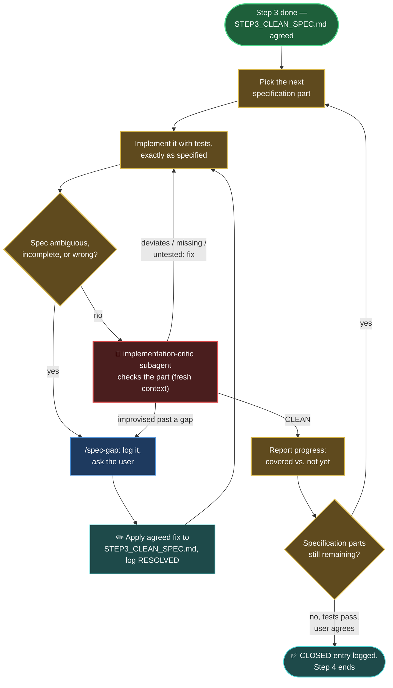

# Step 4 — Implementation

Build production software from the specification — and only from the specification.

## How it starts

- **Precondition**: step 3 is done — `<artifacts>/STEP3_CLEAN_SPEC.md` is the agreed source of truth.
- **Where**: start the AI coding agent inside this folder:

  ```bash
  cd steps/step_04_implementation && claude
  ```

- **Input**: `<artifacts>/STEP3_CLEAN_SPEC.md` — and nothing else. The step 1 prototype is explicitly NOT an input: nobody reads it here, neither the user nor the agent.
- **First move**: the user says where the production implementation must live — its own repository or folder, completely outside this repository, given as a GitHub link or an absolute path on the local disk — and the agent records it as a `clean_impl_resources` entry in the project's `.vibe_to_spec.yaml`. `STEP4_IMPL_SPEC_GAPS.md` is created right away. All code work happens at that location.

## What you say to steer it

This step is a conversation you steer, not a form you fill in. The specification does the describing; you say where the code lives, set the order of work, and resolve every gap the specification leaves open. Below are the kinds of things you would say at each moment of the loop; use your own words, these are only to show the shape.

- **To begin** — say where the production code must live and start building:
  > "The implementation goes at ~/code/my-app-prod. Start with the part of the spec that saves and loads notes."

- **To steer the order** — you set the priorities:
  > "Do the API surface before the storage layer — that's what I care about most."

- **To resolve a specification gap** — the decision only you can make:
  > "The spec doesn't say what happens on a duplicate name. Reject it with an error — and yes, amend the spec to say so."
  > "Good catch, that line is wrong. It should keep the newest, not the oldest. Fix the spec."

- **To close the step** — only when the code covers the spec and tests pass:
  > "This covers the whole spec and the tests are green. Run /close-step."

## How it iterates



See the [global workflow map's legend](../../docs/global_workflow.md#legend) for what each color and symbol means.

1. **Full engineering discipline is back**: the developer's global coding rules apply, tests are written alongside the code, the code is clean and maintainable.
2. **Implement the specification part by part.** The specification is authoritative — the implementation follows it, never reinterprets it.
3. **When the specification is ambiguous, incomplete, or looks wrong**: stop on that point, log it with `/spec-gap`, and ask the user. Never silently improvise around the specification.
4. **Critique each part** with the `implementation-critic` subagent in a fresh context, before it counts as done: it flags where the code deviates from or misses the specification, where an ambiguity was improvised past instead of raised as a gap, and spec'd behavior left untested. Fix the code, or raise the gap, until it comes back clean.
5. **Agreed specification fixes are applied to the step 3 `STEP3_CLEAN_SPEC.md`** — the source of truth stays true — and then implementation continues from the corrected specification.

## How it ends

- The implementation covers the specification completely, and its tests pass.
- **Hand-off**: the implementation and its tests stay in their external repository or folder, recorded as `clean_impl_resources` in the project's `.vibe_to_spec.yaml`; `STEP4_IMPL_SPEC_GAPS.md` lives at `<artifacts>/STEP4_IMPL_SPEC_GAPS.md`. Step 5 checks the implementation against the specification.
- If the implementation later becomes hard to maintain, its repository can be discarded and rebuilt from the specification — the implementation is disposable, the specification is permanent.
