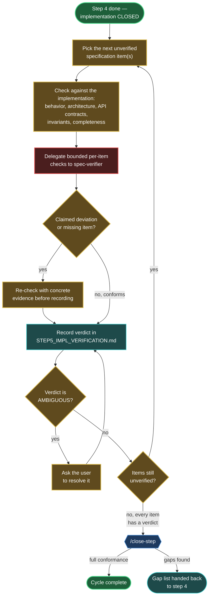

# Step 5 — Verification

Verify that the implementation faithfully realizes the specification.

## How it starts

- **Precondition**: step 4 is done — the implementation and its passing tests are complete, at the location recorded as `clean_impl_resources` in the project's `.vibe_to_spec.yaml`.
- **Where**: start the AI coding agent inside this folder:

  ```bash
  cd steps/step_05_verification && claude
  ```

- **Inputs, read-only**:
  - `<artifacts>/STEP3_CLEAN_SPEC.md` — the yardstick
  - the implementation — the subject under verification, at the external location(s) recorded as `clean_impl_resources` in the project's `.vibe_to_spec.yaml`

  The step 1 prototype is never consulted. Verification is against the specification, not against the exploratory prototype.

## What you say to steer it

This step is a conversation you steer, not a form you fill in. The agent checks the implementation against the specification item by item and reports verdicts backed by evidence; you set what to check, resolve the calls it cannot make, and decide the conclusion. Below are the kinds of things you would say at each moment of the loop; use your own words, these are only to show the shape.

- **To begin** — start a verification pass:
  > "Run /verify. Go through the spec item by item and show me the verdicts."

- **To steer what gets checked** — you can narrow the focus:
  > "Check the invariants first — the 'total always matches the sum' one especially."

- **To resolve an ambiguous verdict** — the call only you can make:
  > "The spec is unclear there, so treat it as conforming — that's what I meant."

- **To conclude** — either everything conforms, or the gaps go back to step 4:
  > "Every item conforms. Run /close-step and complete the cycle."
  > "Those three deviations are real. Hand them back to step 4 to fix, then we verify again."

## How it iterates



See the [global workflow map's legend](../../docs/global_workflow.md#legend) for what each color and symbol means.

1. **Go through the specification item by item**: behavior, architecture, API contracts, invariants, completeness.
2. **Check each item against the implementation** and record a verdict in `STEP5_IMPL_VERIFICATION.md`: conforms / deviates (and how) / missing.
3. **Verify findings before reporting them** — re-check each claimed deviation against both the specification and the code (running it where needed). No unconfirmed claims enter the report.
4. **Delegate bounded checks** to reviewer subagents where useful; their findings go through the same verification before entering the report.

## How it ends

- Every specification item has a verdict in `STEP5_IMPL_VERIFICATION.md`.
- **Full conformance** → the cycle is complete: the specification is the enduring asset, and the implementation in step 4 realizes it.
- **Gaps found** → the gap list goes back to step 4; after the fixes, verification runs again. The loop repeats until `STEP5_IMPL_VERIFICATION.md` shows full conformance.
